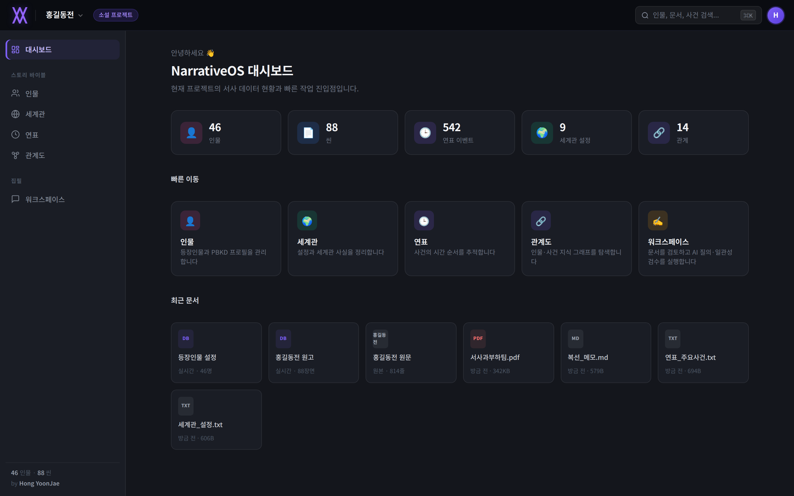
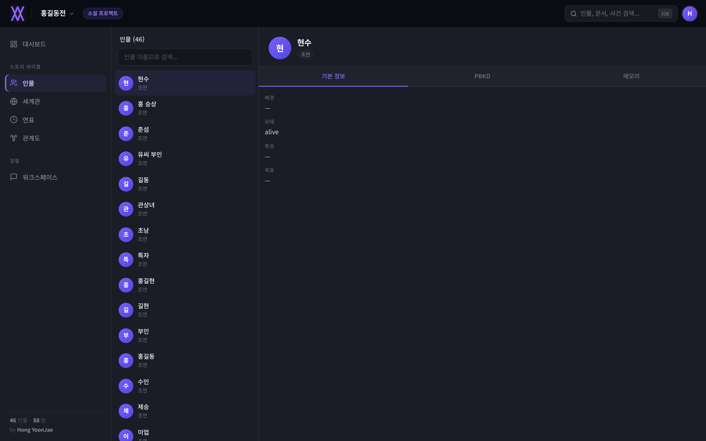
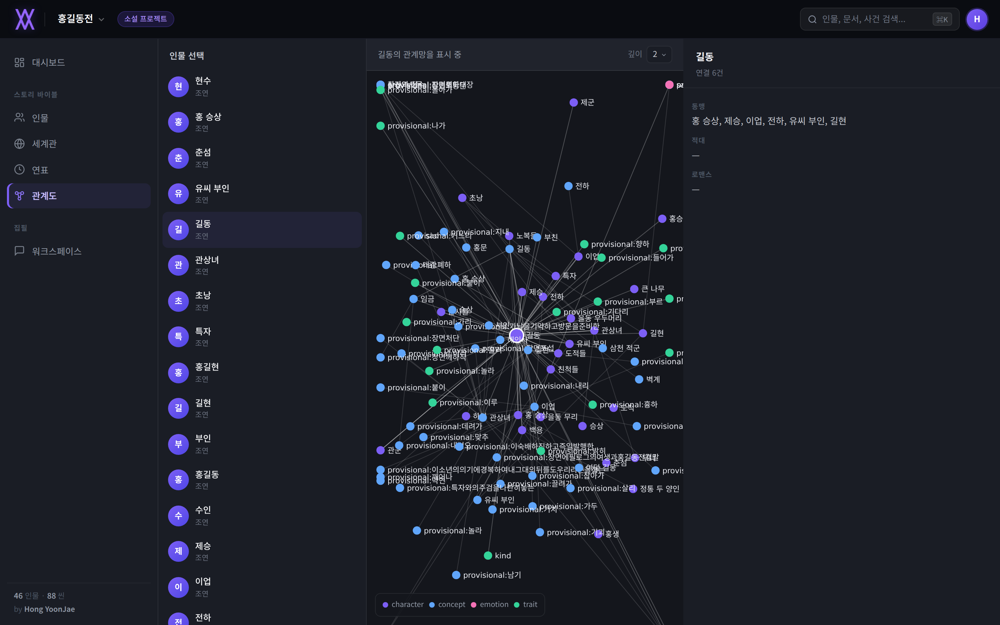
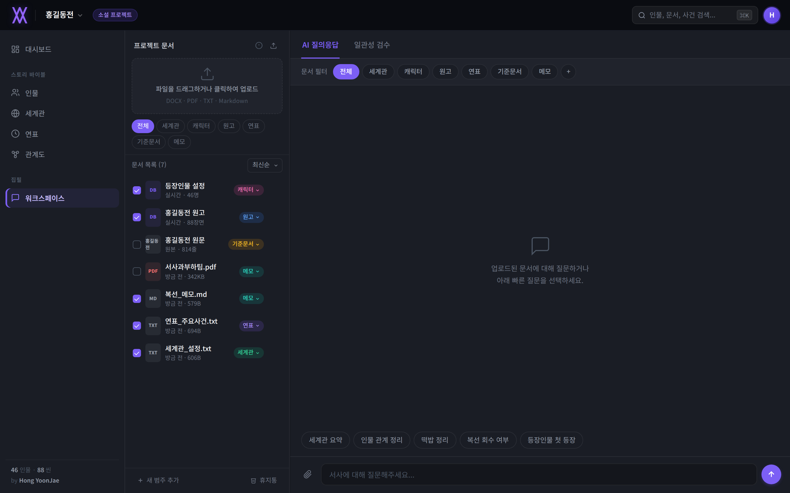

<div align="center">


# NarrativeOS

**An AI co-pilot that keeps a long story's facts straight — so the writer doesn't have to.**

</div>

<p align="center">
  
  
  
  
</p>

---

## The problem

Long-form fiction accumulates state: who is alive, who knows what, who promised what to whom, which rule the world obeys. Past a certain length, no human — and no LLM context window — reliably tracks all of it. The usual failure modes:

- a character acts against beliefs or relationships established chapters ago
- a "dead" character reappears with no explanation
- two chapters silently disagree about a date, a location, or a rule of the world
- an LLM co-writer forgets earlier canon and quietly invents contradicting facts

NarrativeOS treats a story as a **living, queryable state machine** instead of a folder of text files. Every scene that gets processed updates a structured model of characters, relationships, world facts, and a timeline — and that model is what gets checked, queried, and visualized, not just the raw prose.

## What it looks like

| Dashboard | Characters & PBKD |
|---|---|
|  |  |

| Knowledge graph | Workspace (documents · AI Q&A · consistency check) |
|---|---|
|  |  |

The demo ships pre-loaded with **홍길동전** (Hong Gildong-jeon), a 15th-century Korean classic, processed end-to-end through the real pipeline — 46 characters, 88 scenes, 542 timeline events, and a 570+ node knowledge graph, all derived from the actual text rather than placeholder data.

## Key features

- **PBKD character model** — each character is tracked across four dimensions (Personality, Belief, Knowledge, Desire), extracted from scene text with a confidence score and a source scene for every inferred trait, so a character's profile is auditable back to the line that justified it.
- **Symbolic consistency engine** — cross-checks new scene content against established character relationships and prior facts, flagging contradictions (e.g. an ally suddenly treated as an enemy) with the specific conflicting evidence.
- **Content regulation checker** — a separate, rule-based Korean-language pass that flags sexual, violent, hateful, or otherwise policy-relevant content in a scene, independent of narrative consistency, with matched evidence snippets.
- **Knowledge graph** — every character, trait, location, and event becomes a node; relationships (alliance, betrayal, conflict, marriage, …) become edges. Explorable per-character in the UI via a self-contained force-directed canvas renderer — no charting library required.
- **RAG-backed Q&A** — ask questions about the story in natural language ("who has met the protagonist?", "summarize the world's rules") and get answers grounded in the actual character/scene/timeline data, with citations back to source documents.
- **Timeline with signal/noise separation** — narrative events and pipeline bookkeeping events (scene-start logs, location-registration logs) are classified separately, so the timeline view shows what actually happened in the story by default, with system events available behind a toggle.
- **Document workspace** — upload reference material (world bible, canon notes, style guides), tag it by category, and use it as grounding for both the Q&A and consistency-check passes.

## How it works

```
Scene text
   │
   ▼
Entity/event extraction  →  Character state mutation  →  Knowledge graph update
   │                              │                              │
   ▼                              ▼                              ▼
Symbolic consistency check   PBKD reasoning (per-character)   Timeline event log
   │
   ▼
Regulation / content-policy check
   │
   ▼
API (FastAPI)  ⇆  Demo UI (vanilla HTML/CSS/JS, dark-theme SPA)
```

- **Backend**: FastAPI + SQLAlchemy (SQLite by default), with a pluggable LLM layer (local Qwen via Ollama by default; OpenAI and Anthropic supported as alternative providers) and a `sentence-transformers`-based hybrid retriever for RAG.
- **Frontend**: a single-page demo with no build step and no framework — plain HTML/CSS/JS, including a hand-rolled force-directed graph renderer on `<canvas>`.
- **Evaluation harness**: a canonical, hand-labeled 60-chapter dataset built from the same seed text, with injected adversarial corruptions, used to measure entity/event recall and contradiction-detection precision (`scripts/create_canonical_dataset.py`, `scripts/evaluate_canonical.py`).

## Getting started

```bash
git clone <this-repo>
cd NarrativeOS
cp .env.example .env        # fill in your LLM provider settings
poetry install               # or: pip install -r requirements.txt

./scripts/start_demo.sh
```

This starts the backend API (`:8001`), a background scene-analysis worker, and the demo UI (`:4174`) in one shot, with a health check for each. Open **http://127.0.0.1:4174**.

To seed the bundled 홍길동전 dataset yourself (already done in the checked-in `narrativeos.db`, but reproducible):

```bash
python3 scripts/seed_honggildongjeon.py     # characters + scenes
python3 scripts/seed_world_lore.py --write  # world/lore facts
```

## Project structure

```
backend/
  api/routes/          FastAPI routers (narrative, documents, consistency, auth, projects)
  narrative/           state mutation engine, PBKD reasoning, timeline, knowledge graph
  consistency/checkers/  symbolic consistency engine + content regulation checker
  rag/                 hybrid retrieval + embeddings for Q&A
  database/            SQLAlchemy models & repositories, Alembic migrations
frontend/demo/         the dark-theme demo UI (index.html / app.js / styles.css, no build step)
scripts/               seeding, dataset creation, evaluation/benchmark scripts
data/                  seed text + generated scene/canonical datasets
docs/                  architecture notes, ADRs, API spec
```

## Status

This is an active research/portfolio project, not a production-ready product — expect rough edges. Contributions and issue reports around the RAG pipeline, consistency-checking rules, and LLM-provider integrations are especially welcome.
